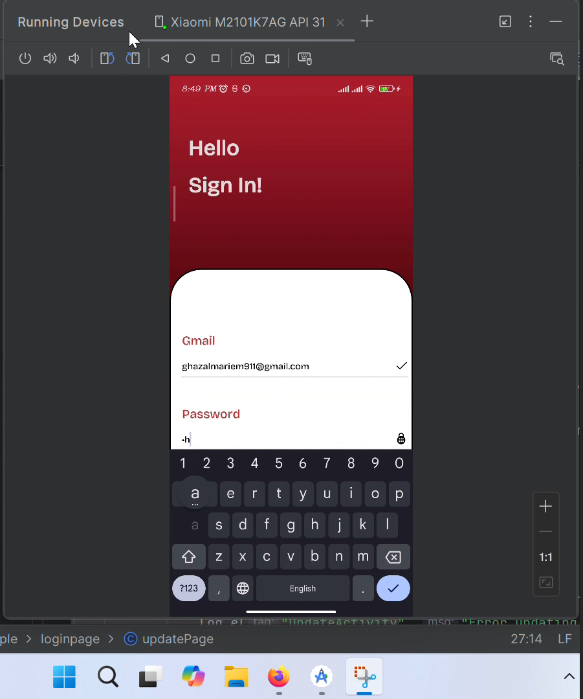
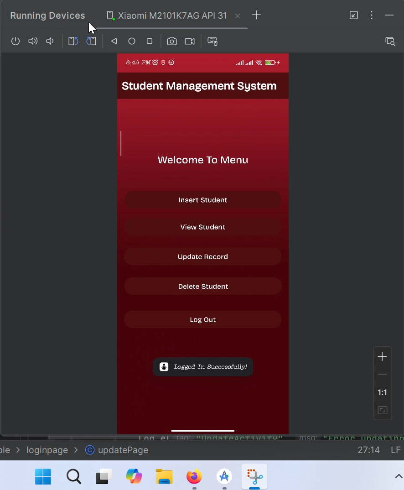
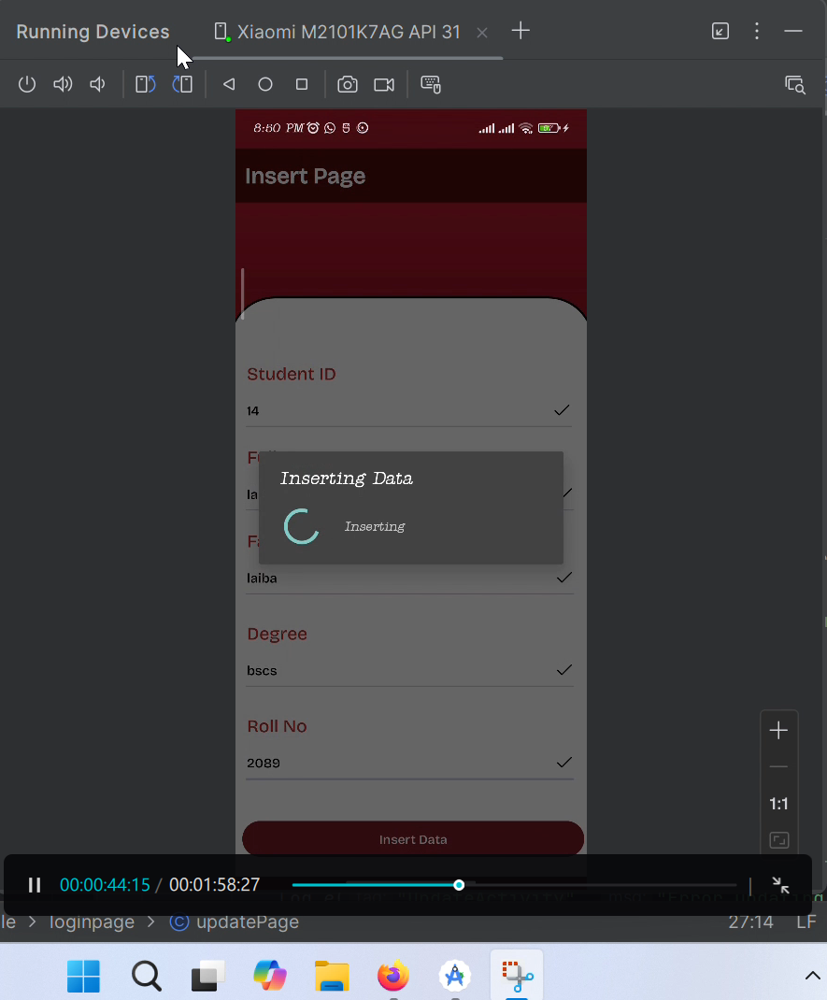
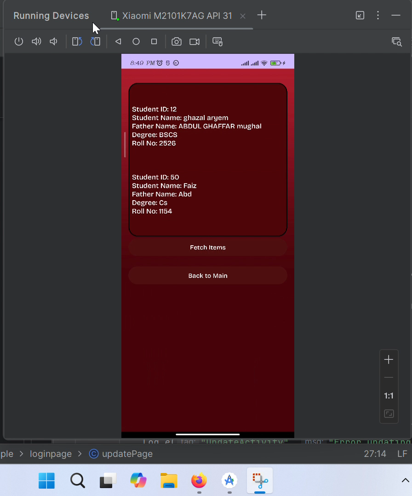
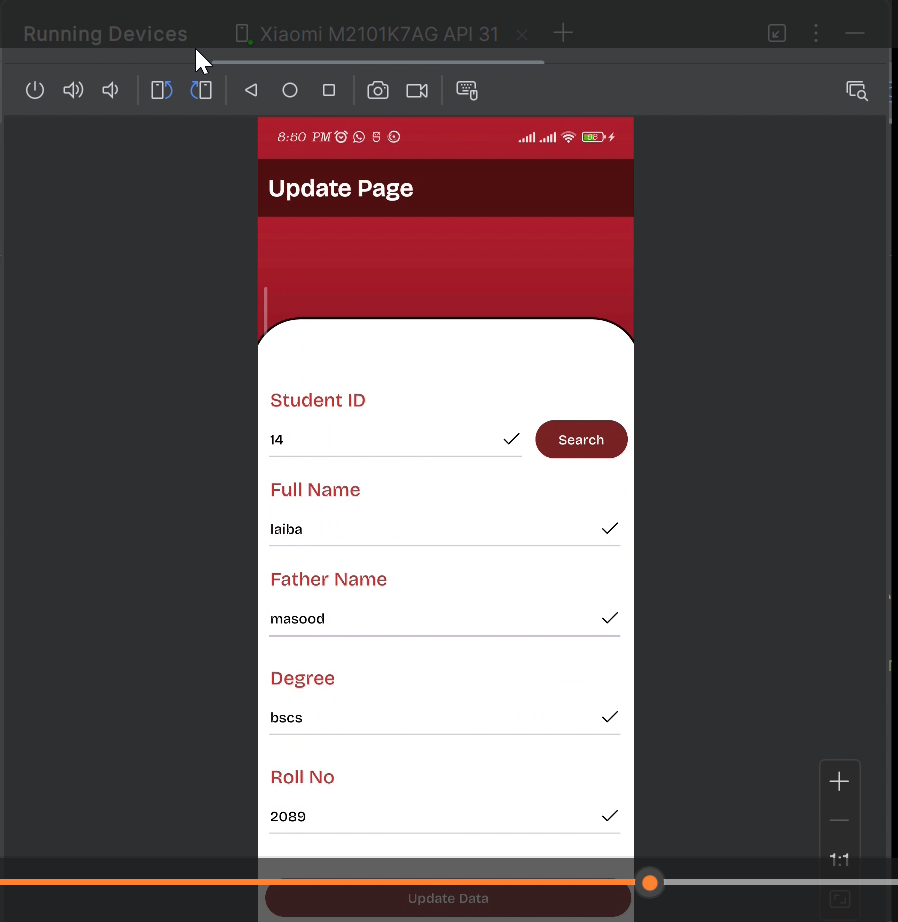
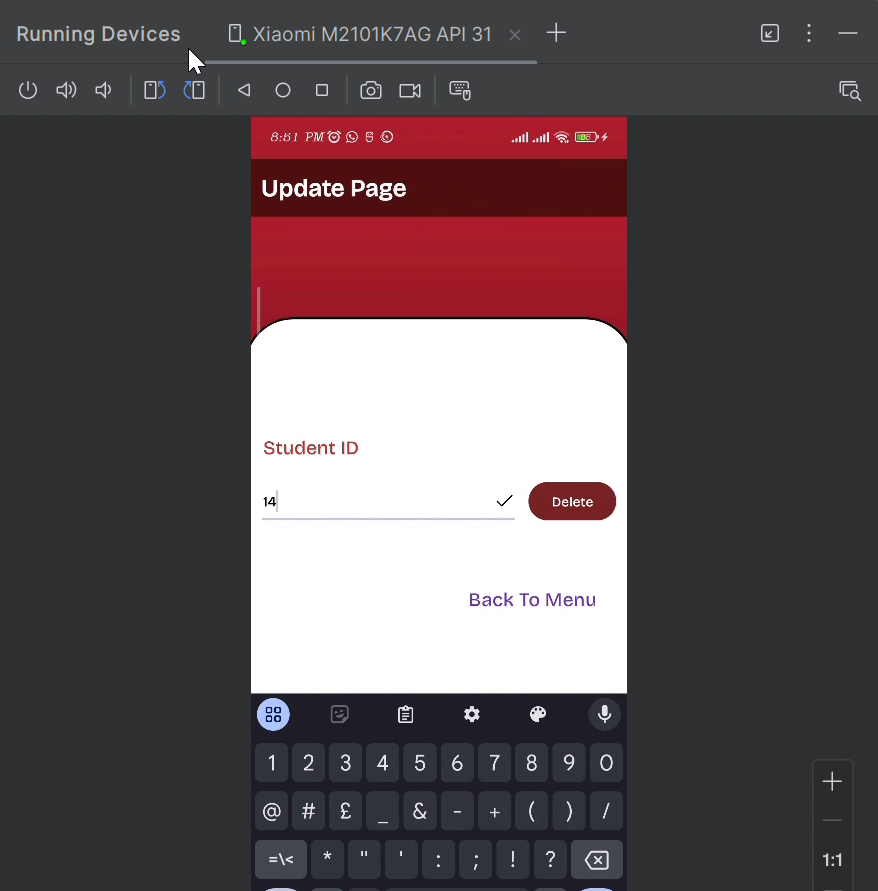

# 📚 Student Management App

This is an Android-based **Student Management System** built using **Android Studio**, **Firebase**, and **Volley API**. The app allows users to **Add**, **Update**, **Delete**, and **View** student records.

---

## 🚀 Features

- 🔐 User Login
- 📥 Add new student details
- 📝 Update existing student data
- ❌ Delete a student record
- 📄 View all student records
- 🔄 Real-time database operations using Firebase
- 🌐 API communication using Volley

---

## 🎥 Project Demo (Screen Recording)

> 📌 _Click the link below to watch the working demo of the app._

**▶️ [Watch Demo Video](asssets/Screen_Recording.mp4)**  
<!-- Replace # with your actual video link, e.g., https://youtu.be/your-video-id -->

---

## 🔧 Technologies Used

- **Java (Android Studio)**
- **Firebase Realtime Database**
- **Volley Library** for API calls
- **Material Design UI Components**

---

## 📷 Screenshots

> 📌 _Replace the placeholder text with actual screenshots later._

### 🔐 Login Screen


### 🏠 Home Screen


### ➕ Add Student


### 🧾 View Student List


### ✏️ Update Student


### ❌ Delete Student


---

## 🛠️ How to Run the Project

1. Clone the repository  
   ```bash
   git clone https://github.com/Ghazal-Aryem/Student_Management.git
